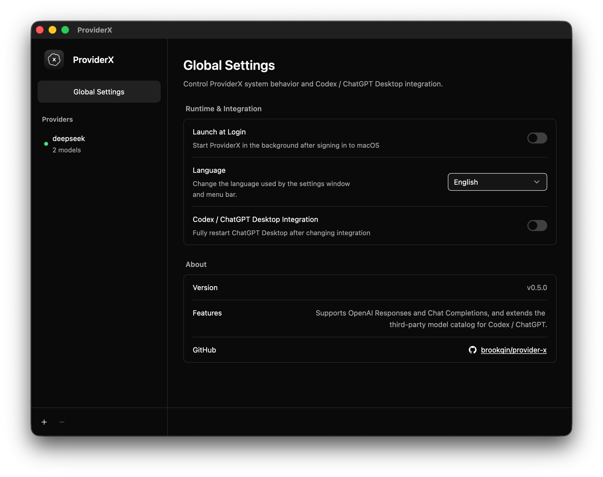
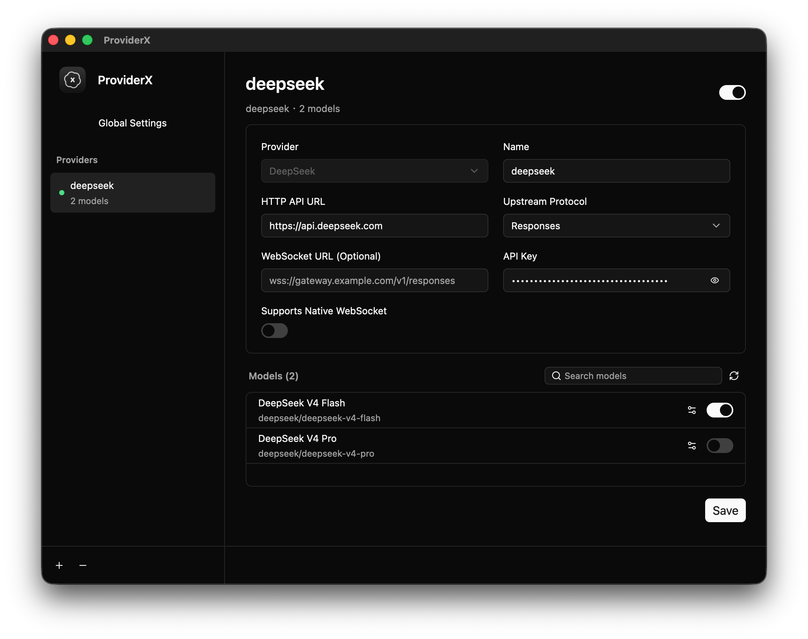
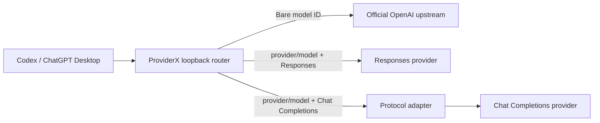

# ProviderX

[English](README.md) | [简体中文](README.zh-CN.md)

ProviderX is a lightweight Apple Silicon macOS menu-bar application for people who already have a
ChatGPT subscription and use Codex or ChatGPT Desktop. Its primary goal is to expand the available
third-party models in a way that stays as close as possible to the native model experience, while
preserving official OpenAI models and subscription-backed access.

It exposes a protected loopback egress router, extends the model catalog with namespaced provider
models, and adapts Codex's OpenAI Responses traffic to the transport and protocol supported by each
configured provider.

## Why ProviderX?

- **Preserve ChatGPT personalization.** The project began after the author's ChatGPT personalization
  settings were once reset. ProviderX limits itself to the Codex settings it must manage, preserves
  unrelated configuration, detects external changes, and keeps recovery data for restoration.
- **Avoid another heavyweight runtime.** ProviderX does not install or bundle another Chromium
  runtime, embedded browser, Bun, or Node.js.
- **Use fewer resources.** An embedded browser plus an H5 interface is unnecessary for a small
  settings application. ProviderX uses GPUI for a native settings window and runs as a native macOS
  menu-bar application.
- **Stay focused.** ProviderX is not intended to become an all-purpose AI gateway. Its purpose is to
  preserve the native capabilities of the primary GPT experience while adding a small selection of
  cost-effective third-party models.

## Screenshots

<p align="center">&nbsp;</p>

## Features

- Route bare model IDs to the official OpenAI upstream without changing their identity.
- Route namespaced IDs such as `provider-a/coder` to the matching third-party provider while sending
  only `coder` upstream.
- Support OpenAI Responses over HTTP/SSE and native WebSocket.
- Bridge Codex WebSocket sessions to HTTP/SSE for providers without native WebSocket support.
- Adapt Responses requests, streaming events, tool calls, and bounded session history to OpenAI Chat
  Completions providers.
- Discover provider models explicitly and enrich missing metadata with exact matches from
  [models.dev](https://models.dev/).
- Manage provider settings, model visibility and capabilities, Codex integration, launch at login,
  and English or Simplified Chinese UI from a native GPUI settings window.
- Respect `HTTP_PROXY`, `HTTPS_PROXY`, `ALL_PROXY`, and `NO_PROXY` for upstream connections.
- Record redacted runtime and request errors in private daily local logs with 10-day retention.

### Planned

- Support the Anthropic protocol.
- Add provider templates for GLM, KIMI, MiniMax, and other services.
- Support complete third-party subagent scheduling, including readable task delivery and follow-up
  messages.

## How It Works



ProviderX configures Codex to use a local URL shaped like
`http://127.0.0.1:<port>/<random-capability>/v1`. The router inspects the top-level model ID and
selects the route:

- Bare IDs remain official models and are transparently forwarded.
- `<provider-id>/<model-id>` selects an enabled third-party provider.
- Unknown or stale namespaced models fail closed instead of falling back to another provider.

ProviderX merges enabled third-party models into the model-list response seen by Codex. A complete
restart of ChatGPT Desktop is required after provider or integration changes before its model picker
is expected to refresh.

## Supported Upstream Protocols

| Upstream protocol | HTTP/SSE | Native WebSocket | Codex WebSocket bridge |
| --- | --- | --- | --- |
| OpenAI Responses | Yes | Optional | Yes, when the provider is HTTP-only |
| OpenAI Chat Completions | Yes | No | Yes, through the protocol adapter |

Protocol feature parity still depends on the upstream provider. Unsupported Chat Completions items
or tools are rejected or deliberately omitted according to the adapter contract rather than being
silently misrepresented.

## Known Limitations

### Task delivery to third-party subagents

A namespaced third-party model such as `provider-id/model-id` can be explicitly selected for a
subagent, and the subagent can start with that model. The current limitation is task delivery:
Codex's native multi-agent v2 protocol encrypts the `message` fields used by `spawn_agent`,
`send_message`, and `followup_task`, then delivers the task body as
`agent_message.encrypted_content`.

ProviderX receives only that encrypted content and cannot decrypt or convert it for a third-party
provider. As a result, model selection can succeed while the subagent sees that a task exists but
cannot read its details. Declaring `multi_agent_version = "v2"` makes the model eligible for native
subagent selection; it does not make the provider compatible with OpenAI's encrypted inter-agent
communication. This limitation does not affect selecting a third-party model for the main agent.

## Requirements

- Apple Silicon Mac (`arm64`)
- Rust 1.85 or newer with Cargo
- Xcode Command Line Tools, including `codesign`, `iconutil`, `lipo`, and `plutil`
- Credentials for each third-party provider you choose to configure

ProviderX v1 does not run on Intel macOS, Linux, or Windows.

## Build from Source

```sh
git clone https://github.com/brookqin/provider-x.git
cd provider-x
./scripts/build-macos-app.sh
open target/macos/ProviderX.app
```

The build script creates `target/macos/ProviderX.app`, applies an ad-hoc signature by default, and
runs the bundle verifier automatically. To use an explicitly authorized signing identity:

```sh
PROVIDER_X_CODESIGN_IDENTITY="Developer ID Application: Example" \
  ./scripts/build-macos-app.sh
```

## Configure a Provider

1. Launch ProviderX and choose **Open Settings** from its menu-bar item.
2. Select **Add provider**.
3. Choose a provider template or **Custom**, then enter its name, upstream protocol, HTTP endpoint,
   optional WebSocket endpoint, transport support, and API key.
4. Refresh the model list. Review model names and optional capability metadata as needed.
5. Save the provider and enable it.
6. Open **Global Settings** and enable **Codex / ChatGPT Desktop Integration**.
7. Fully quit and restart ChatGPT Desktop, then select a namespaced model such as
   `provider-id/model-id`.

When integration is disabled, ProviderX restores the Codex settings it previously managed as long
as those values have not been changed externally. Keep ProviderX running until active tasks finish,
then restart ChatGPT Desktop.

## Local Data

Provider configuration, model caches, recovery receipts, and UI preferences are stored under:

```text
~/Library/Application Support/dev.qiankun.provider-x/
```

Provider API keys are stored locally in the private provider configuration. ProviderX uses
restrictive permissions, regular-file checks, atomic writes, and concurrent-change detection. Codex
integration updates only its managed settings in `~/.codex/config.toml` and preserves unrelated
configuration.

Redacted runtime and request errors are written as JSON Lines to
`logs/provider-x-YYYY-MM-DD.log`. Files rotate on the Mac's local calendar date, and ProviderX keeps
the current day plus the previous nine days. Error records contain diagnostic fields such as the
request method, path without its query string, ingress-authorization result, status, and stable
error code. Unauthorized paths are retained in full unless the first segment has the canonical
64-character capability shape; only that segment is replaced with `<redacted-capability>`. Logs do
not contain raw authorization data, ingress capabilities, request or response bodies, or original
Codex configuration contents.

Do not publish either directory or include its contents in issue reports.

## Security Design

- The ingress listener is restricted to `127.0.0.1` and protected by a random 256-bit capability in
  the URL path.
- Browser-origin WebSocket upgrades are rejected.
- Official credentials are isolated from third-party routes; each provider receives only its own
  configured authorization.
- Request bodies, streams, session history, connection counts, and idle periods are bounded.
- Cancellation and graceful shutdown propagate to active upstream work.
- Requests that may already have reached an upstream are never automatically replayed.
- Secret-bearing debug output and probe evidence are redacted.

ProviderX is an egress router, not a credential vault. Protect your macOS account and local storage
accordingly.

## Development

The project is a Cargo workspace using Rust 2024. See [AGENTS.md](AGENTS.md) for crate boundaries,
architectural invariants, security requirements, and change-specific validation guidance.

Baseline checks:

```sh
cargo fmt --all -- --check
cargo test --workspace
cargo clippy --workspace --all-targets -- -D warnings
git diff --check
```

Apple Silicon macOS bundle and lifecycle checks:

```sh
./scripts/build-macos-app.sh
./scripts/smoke-macos-shell.sh
```

Live provider and real Codex/ChatGPT Desktop probes are opt-in. Never record authorization headers,
cookies, OAuth tokens, account IDs, attestation data, complete request bodies, or unredacted local
configuration as test evidence.

## License

ProviderX is licensed under the [GNU General Public License v3.0 only](LICENSE).
