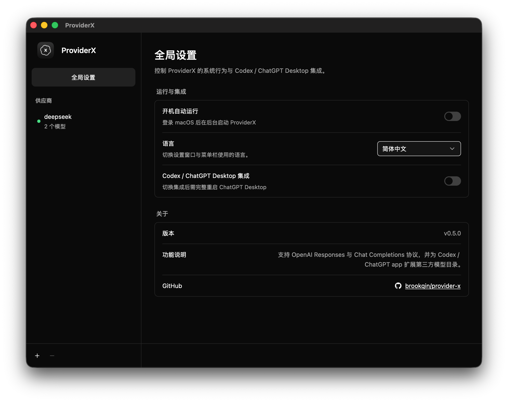
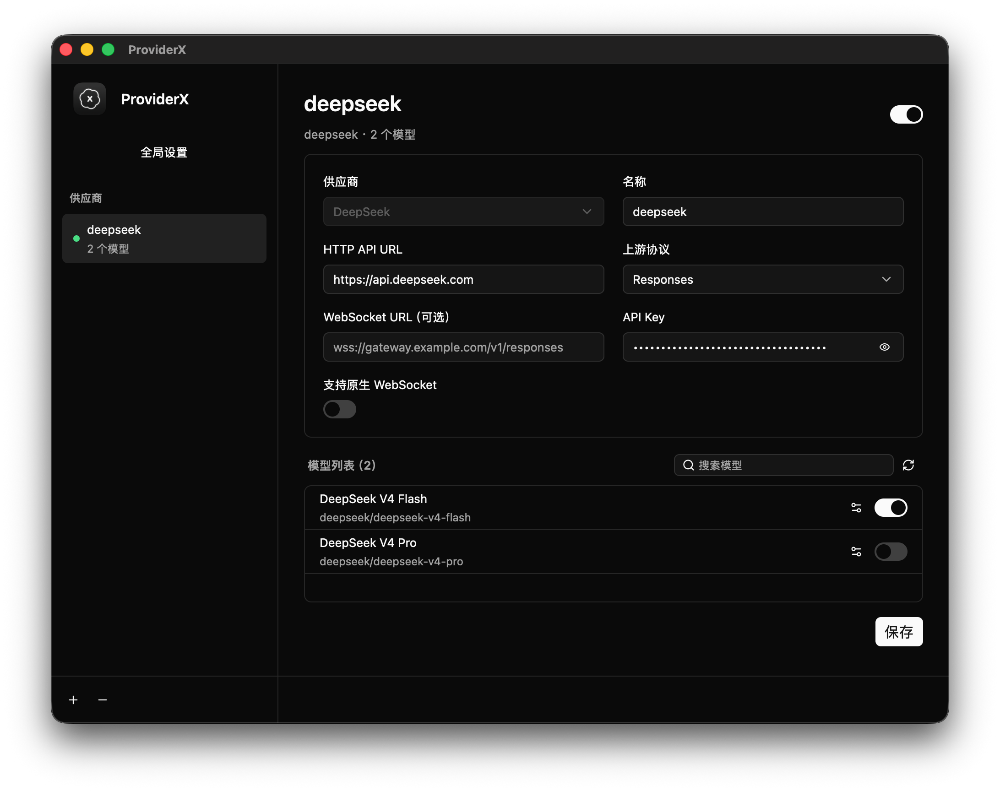
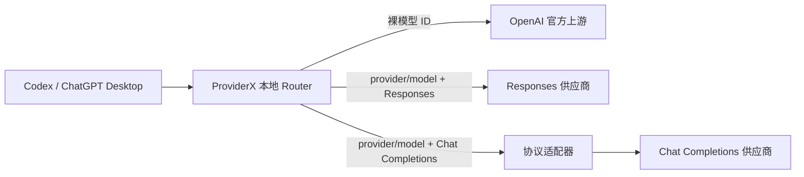

# ProviderX

[English](README.md) | [简体中文](README.zh-CN.md)

ProviderX 是一款面向 Apple Silicon macOS 的轻量级菜单栏应用，适用于已经拥有 ChatGPT 订阅并使用 Codex 或 ChatGPT Desktop 的用户。它的主要目标，是在保留 OpenAI 官方模型和订阅访问方式的前提下，以尽可能接近原生模型的使用体验扩充可用的第三方模型。

ProviderX 在本机提供受保护的 Egress Router，通过带供应商命名空间的模型扩展模型目录，并根据各供应商支持的传输方式与协议转换 Codex 的 OpenAI Responses 流量。

## 为什么开发 ProviderX？

- **保护 ChatGPT 个性化设置。** 作者的 ChatGPT 个性化设置曾被重置，因此 ProviderX 只修改 Codex 集成所必需的受管配置，保留无关设置、检测外部变更，并保存可用于恢复的回执。
- **避免引入另一套庞大运行时。** ProviderX 不会额外安装或内嵌 Chromium、浏览器、Bun 或 Node.js。
- **降低资源消耗。** 对一个小型设置应用而言，内嵌浏览器加 H5 界面过于沉重，因此 ProviderX 使用 GPUI 实现原生设置窗口，并作为原生 macOS 菜单栏应用运行。
- **保持功能聚焦。** ProviderX 不打算成为全功能 AI Gateway；它只希望保留主力 GPT 的原生能力，同时补充少量高性价比的第三方模型。

## 界面预览

<p align="center">&nbsp;</p>

## 功能特性

- 裸模型 ID 仍路由至 OpenAI 官方上游，且不改变模型身份。
- `provider-a/coder` 这类带命名空间的模型会路由至对应的第三方供应商，上游仅收到 `coder`。
- 支持基于 HTTP/SSE 和原生 WebSocket 的 OpenAI Responses 协议。
- 对不支持原生 WebSocket 的供应商，将 Codex WebSocket 会话桥接至 HTTP/SSE。
- 将 Responses 请求、流式事件、工具调用和有界会话历史适配至 OpenAI Chat Completions 供应商。
- 由用户主动刷新供应商模型，并使用 [models.dev](https://models.dev/) 的精确匹配结果补充缺失元数据。
- 通过原生 GPUI 设置窗口管理供应商、模型可见性与能力、Codex 集成、开机运行以及英文或简体中文界面。
- 上游连接支持 `HTTP_PROXY`、`HTTPS_PROXY`、`ALL_PROXY` 和 `NO_PROXY`。

### 计划中

- 支持 Anthropic 协议。
- 增加 GLM、KIMI、MiniMax 等供应商模板。
- 完整支持第三方模型的 subagent 调度，包括可读的任务详情传递和后续消息通信。

## 工作原理



ProviderX 将 Codex 配置为使用形如 `http://127.0.0.1:<port>/<random-capability>/v1` 的本地地址。Router 检查顶层模型 ID 并选择路由：

- 裸 ID 视为官方模型，并透明转发。
- `<provider-id>/<model-id>` 选择已启用的第三方供应商。
- 未知或已经失效的命名空间模型会直接失败，不会回退到其他供应商。

ProviderX 会将已启用的第三方模型合并到 Codex 看到的模型列表中。供应商或集成状态发生变化后，需要完整重启 ChatGPT Desktop，其模型选择器才会刷新。

## 支持的上游协议

| 上游协议 | HTTP/SSE | 原生 WebSocket | Codex WebSocket 桥接 |
| --- | --- | --- | --- |
| OpenAI Responses | 支持 | 可选 | HTTP-only 供应商支持 |
| OpenAI Chat Completions | 支持 | 不支持 | 通过协议适配器支持 |

协议能力仍取决于具体上游供应商。Chat Completions 不支持的输入项或工具会按照适配器契约被拒绝或明确省略，不会被静默转换成错误语义。

## 已知限制

### 第三方 Subagent 无法接收任务详情

目前可以为 subagent 显式指定 `provider-id/model-id` 这类带命名空间的第三方模型，subagent 也可以使用该模型启动。限制发生在任务详情传递环节：Codex 原生 multi-agent v2 协议会加密 `spawn_agent`、`send_message` 和 `followup_task` 使用的 `message` 字段，并将任务正文作为 `agent_message.encrypted_content` 传递。

ProviderX 收到的只有密文，无法为第三方供应商解密或转换。因此实际表现是模型指定成功，subagent 也知道有新任务，但无法读取任务详情。声明 `multi_agent_version = "v2"` 只能让模型通过原生 subagent 的选择条件，并不表示该供应商兼容 OpenAI 的 Agent 间加密通信。这一限制不影响主 Agent 选择第三方模型。

## 环境要求

- Apple Silicon Mac（`arm64`）
- Rust 1.85 或更高版本及 Cargo
- Xcode Command Line Tools，包括 `codesign`、`iconutil`、`lipo` 和 `plutil`
- 可从 `PATH`、`/opt/homebrew/bin/codex` 或 `/usr/local/bin/codex` 找到并正常运行的 `codex`
- 所配置第三方供应商的访问凭据

ProviderX v1 不支持 Intel macOS、Linux 或 Windows。

## 从源码构建

```sh
git clone https://github.com/brookqin/provider-x.git
cd provider-x
./scripts/build-macos-app.sh
open target/macos/ProviderX.app
```

构建脚本会生成 `target/macos/ProviderX.app`，默认使用 ad-hoc 签名，并自动执行 App Bundle 验证。如需使用已经明确授权的签名身份：

```sh
PROVIDER_X_CODESIGN_IDENTITY="Developer ID Application: Example" \
  ./scripts/build-macos-app.sh
```

## 配置供应商

1. 启动 ProviderX，从菜单栏项目中选择 **打开设置**。
2. 选择 **新增供应商**。
3. 选择供应商模板或 **自定义**，然后填写名称、上游协议、HTTP 地址、可选 WebSocket 地址、传输能力和 API Key。
4. 刷新模型列表，并按需检查模型名称及可选能力元数据。
5. 保存并启用供应商。
6. 打开 **全局设置**，启用 **Codex / ChatGPT Desktop 集成**。
7. 完整退出并重新启动 ChatGPT Desktop，然后选择类似 `provider-id/model-id` 的命名空间模型。

停用集成时，只要 ProviderX 管理的配置值没有被外部修改，它就会恢复启用集成前的 Codex 设置。请保持 ProviderX 运行至现有任务结束，然后再重启 ChatGPT Desktop。

## 本地数据

供应商配置、模型缓存、恢复回执和界面偏好存储在：

```text
~/Library/Application Support/dev.qiankun.provider-x/
```

供应商 API Key 保存在本机私有配置中。ProviderX 使用严格的文件权限、普通文件检查、原子写入和并发修改检测。Codex 集成只更新 `~/.codex/config.toml` 中由 ProviderX 管理的设置，并保留无关配置。

请勿公开上述目录，也不要将其中内容直接附加到 Issue 报告中。

## 安全设计

- 本地入口仅监听 `127.0.0.1`，并通过 URL 路径中的随机 256 位 capability 进行保护。
- 拒绝带浏览器 Origin 的 WebSocket Upgrade。
- 官方凭据与第三方路由隔离；每个供应商只会收到其自身配置的认证信息。
- 请求体、流、会话历史、连接数和空闲时间均有上限。
- 取消操作和优雅退出会传播到仍在执行的上游工作。
- 对可能已经到达上游的请求绝不自动重放。
- 含敏感信息的调试输出和探针证据会经过脱敏。

ProviderX 是 Egress Router，不是凭据保险库。请妥善保护 macOS 账户和本地存储。

## 开发

本项目是使用 Rust 2024 的 Cargo Workspace。Crate 边界、架构约束、安全要求和按变更范围选择验证方式的说明见 [AGENTS.md](AGENTS.md)。

基础检查：

```sh
cargo fmt --all -- --check
cargo test --workspace
cargo clippy --workspace --all-targets -- -D warnings
git diff --check
```

Apple Silicon macOS App Bundle 与生命周期检查：

```sh
./scripts/build-macos-app.sh
./scripts/smoke-macos-shell.sh
```

真实供应商及真实 Codex/ChatGPT Desktop 探针必须显式启用。测试证据不得记录 Authorization Header、Cookie、OAuth Token、账户 ID、Attestation 数据、完整请求体或未经脱敏的本地配置。

## 许可证

ProviderX 仅以 [GNU General Public License v3.0](LICENSE) 授权。
